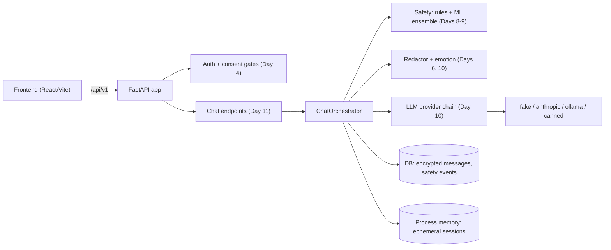
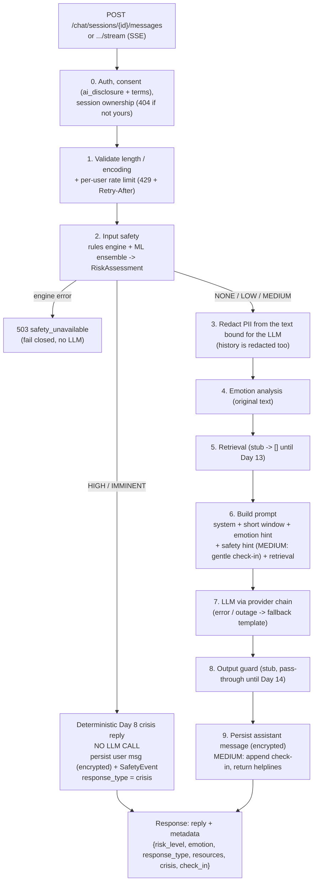

# Architecture

How a message travels through Manovia. Decisions and their reasons live in the
[ADRs](adr/); this page is the map. Day 11 added the chat orchestrator
([ADR 0011](adr/0011-chat-orchestrator.md)), which is the first place the
earlier layers run in sequence.

## System

## The chat pipeline

One user message, in this exact order. **The order is the safety property**:
nothing that can call a model runs before the crisis gate, and nothing leaves
the process before redaction.

### What each step may and may not do

| # | Step | On failure | Notes |
| --- | --- | --- | --- |
| 1 | Validate, rate limit | 422 / 429 | Before any work; blank, over-long and control-character input is refused with a curated message. |
| 2 | Input safety | **503, no LLM** | HIGH/IMMINENT end the pipeline here. MEDIUM continues with a hint and an appended check-in. |
| 3 | Redaction | No model call, canned fallback | Idempotent; the provider chain redacts again. |
| 4 | Emotion | `emotion = None` | Reads the *original* text. |
| 5 | Retrieval | `[]` | Stub until Day 13. |
| 6 | Prompt | n/a | Hints go in the system prompt; user id never included. |
| 7 | LLM | Fallback template | `response_type = fallback`, `degraded = true`; never a 500. |
| 8 | Output guard | Canned reply | Stub until Day 14; `requires_full_text` makes streams buffer-then-release. |
| 9 | Persist | Logged, reply still returned | `persisted = false`. |

## Where a conversation lives

| | Ephemeral (default) | Saved (`save_history = true`) |
| --- | --- | --- |
| Needs consent | `ai_disclosure`, `terms` | + `store_chat` |
| Stored in | Process memory, 30-minute sliding TTL | `chat_sessions` + `messages` (Fernet-encrypted text) |
| After idle / restart | Gone | Kept |
| MEDIUM+ turn | Anonymous `SafetyEvent` (no user, no session, no text) | `SafetyEvent` linked to the session |

## Response contract

JSON: `{reply, session_id, message_id, metadata}`.
SSE: zero or more `event: token` (`{"text"}`), then one `event: final` with the
same fields plus `replaced`; `final.reply` is authoritative.

`metadata.response_type` precedence: `crisis` > `fallback` > `check_in` >
`normal`. `metadata.crisis` carries what the frontend `CrisisCard` needs
(message, helplines, emergency instruction). Helpline data comes only from
`backend/app/content/helplines.json`.

## Not here yet

Retrieval (Day 13), the output guard (Day 14) and the chat UI. Their seams
(`Retriever`, `OutputGuard`, `ChatPage.tsx`) exist and are tested as stubs.
